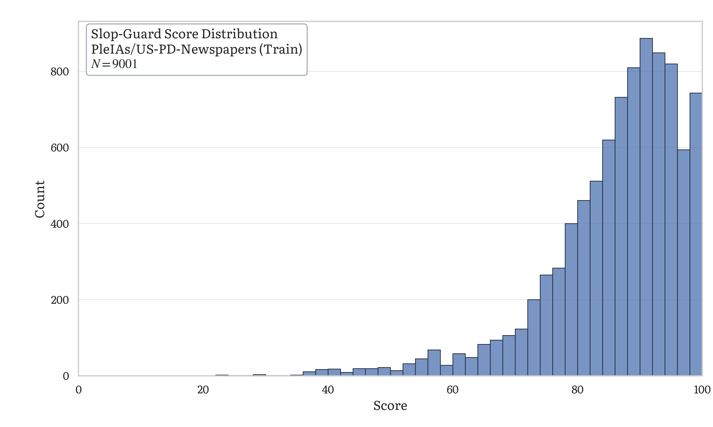
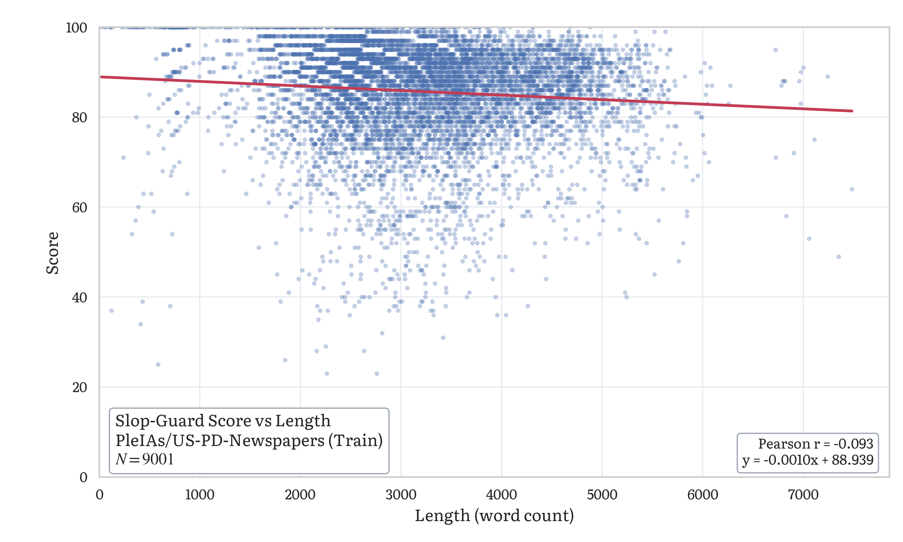

# slop-guard

A rule-based prose linter that scores text 0--100 for formulaic AI writing patterns. No LLM judge, no API calls. Pure regex.

It runs ~80 compiled patterns against your text and returns a numeric score, a list of specific violations with surrounding context, and concrete advice for each hit.

## Add to Your Agent

### Claude Code

Add to your `.mcp.json`:

```json
{
  "mcpServers": {
    "slop-guard": {
      "command": "uvx",
      "args": ["slop-guard"]
    }
  }
}
```

### Codex

Add to your `~/.codex/config.toml`:

```toml
[mcp_servers.slop-guard]
command = "uvx"
args = ["slop-guard"]
```

If you want a fixed release, pin it in `args`, for example: `["slop-guard==0.1.0"]`.

## Installation (Optional)

Requires [uv](https://docs.astral.sh/uv/).

Run without installing (recommended for MCP setups):

```bash
uvx slop-guard
```

Install a persistent command:

```bash
uv tool install slop-guard
```

Then run:

```bash
slop-guard
```

You can pin versions for reproducibility:

```bash
uvx slop-guard==0.1.0
```

Upgrade an installed tool:

```bash
uv tool upgrade slop-guard
```

## Run from source

From a local checkout:

```bash
uv run slop-guard
```

This starts a stdio-based MCP server from the current repository.

## Tools

`check_slop(text)` -- Analyze a string. Returns JSON.

`check_slop_file(file_path)` -- Read a file from disk and analyze it. Same output, plus a `file` field.

## What it catches

The linter checks for overused vocabulary (adjectives, verbs, nouns, hedging adverbs), stock phrases and filler, structural patterns (bold-header-explanation blocks, long bullet runs, triadic lists, bold-term bullet runs, bullet-heavy formatting), tone markers (meta-communication, false narrativity, sentence-opener tells, weasel phrases, AI self-disclosure), rhythm monotony (uniform sentence length), em dash and elaboration colon density, contrast pairs, setup-resolution patterns, and repeated multi-word phrases (4-8 word n-grams appearing 3+ times).

Scoring uses exponential decay: `score = 100 * exp(-lambda * density)`, where density is the weighted penalty sum normalized per 1000 words. Claude-specific categories (contrast pairs, setup-resolution, pithy fragments) get a concentration multiplier. Repeated use of the same tic costs more than diverse violations.

## Scoring bands

| Score | Band |
|-------|------|
| 80-100 | Clean |
| 60-79 | Light |
| 40-59 | Moderate |
| 20-39 | Heavy |
| 0-19 | Saturated |

## Output

Both tools return JSON with this structure:

```
score          0-100 integer
band           "clean" / "light" / "moderate" / "heavy" / "saturated"
word_count     integer
violations     array of {type, rule, match, context, penalty}
counts         per-category violation counts
total_penalty  sum of all penalty values
weighted_sum   after concentration multiplier
density        weighted_sum per 1000 words
advice         array of actionable strings, one per distinct issue
```

`violations[].type` is always `"Violation"` for typed records.

## Benchmark snapshot

Example score distribution from `benchmark/us_pd_newspapers_histogram.py` on
`PleIAs/US-PD-Newspapers` (first 9,001 rows of one local shard):



Example score-vs-length scatter plot from
`benchmark/us_pd_newspapers_scatter.py` on the same shard:



## License

MIT
