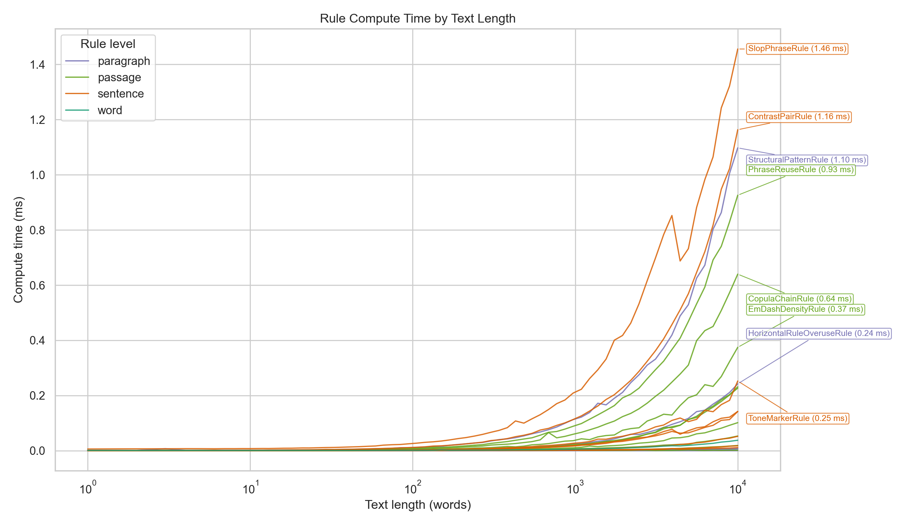

# slop-guard

A rule-based prose linter that scores text 0--100 for formulaic AI writing patterns. No LLM judge, no API calls. Purely programmatic.

It runs ~80 compiled patterns against your text and returns a numeric score, a list of specific violations with surrounding context, and concrete advice for each hit.

## Add to Your Agent

### Claude Code

Add from the command line:

```bash
claude mcp add slop-guard -- uvx slop-guard
```

Add to your `.mcp.json`:

```json
{
  "mcpServers": {
    "slop-guard": {
      "command": "uvx",
      "args": ["slop-guard"]
    }
  }
}
```

### Codex

Add from the command line:

```bash
codex mcp add slop-guard -- uvx slop-guard
```

Add to your `~/.codex/config.toml`:

```toml
[mcp_servers.slop-guard]
command = "uvx"
args = ["slop-guard"]
```

If you want a fixed release, pin it in `args`, for example: `["slop-guard==0.2.0"]`.

## CLI

The `sg` command lints prose files from the terminal. No API keys, no network calls.

### Quick start

```bash
# Run without installing
uvx --from slop-guard sg README.md

# Or install it
uv tool install slop-guard
sg README.md
```

### Usage

```
sg [OPTIONS] INPUT [INPUT ...]
```

`sg` requires at least one input. Each input can be a file path, `-` for stdin, or quoted inline prose text:

```bash
sg "This is some test text"
echo "This is a crucial paradigm shift." | sg -
```

Lint multiple files at once (shell-level glob expansion):

```bash
sg docs/*.md README.md
sg path/**/*.md
```

### Options

| Flag | Description |
|------|-------------|
| `-j`, `--json` | Output results as JSON |
| `-v`, `--verbose` | Show individual violations and advice |
| `-q`, `--quiet` | Only print sources that fail the threshold |
| `-t SCORE`, `--threshold SCORE` | Minimum passing score (0-100). Exit 1 if any file scores below this |
| `-c`, `--concise` | Print only numeric score output |
| `--counts` | Show per-rule hit counts in the summary line |

### Examples

```bash
# One-line summary per file
sg draft.md
# => draft.md: 72/100 [light] (1843 words) *

# Concise output (score only)
sg -c draft.md

# Verbose output with violations and advice
sg -v draft.md

# JSON for scripting
sg -j report.md | jq '.score'

# CI gate: fail if any file scores below 60
sg -t 60 docs/*.md

# Quiet mode: only show failures
sg -q -t 60 **/*.md
```

### Exit codes

| Code | Meaning |
|------|---------|
| 0 | Success (all files pass threshold, or no threshold set) |
| 1 | One or more files scored below the threshold |
| 2 | Error (bad file path, read failure, etc.) |

## Installation

Requires [uv](https://docs.astral.sh/uv/).

Run without installing (recommended for MCP setups):

```bash
uvx slop-guard
```

Install persistently (gives you both `slop-guard` MCP server and `sg` CLI):

```bash
uv tool install slop-guard
```

Pin versions for reproducibility:

```bash
uvx slop-guard==0.2.0
```

Upgrade an installed tool:

```bash
uv tool upgrade slop-guard
```

### From source

From a local checkout:

```bash
uv run slop-guard   # MCP server
uv run sg            # CLI linter
```

## MCP Tools

`check_slop(text)` -- Analyze a string. Returns JSON.

`check_slop_file(file_path)` -- Read a file from disk and analyze it. Same output, plus a `file` field.

## What it catches

The linter checks for overused vocabulary (adjectives, verbs, nouns, hedging adverbs), stock phrases and filler, structural patterns (bold-header-explanation blocks, long bullet runs, triadic lists, bold-term bullet runs, bullet-heavy formatting), tone markers (meta-communication, false narrativity, sentence-opener tells, weasel phrases, AI self-disclosure), rhythm monotony (uniform sentence length), em dash and elaboration colon density, contrast pairs, setup-resolution patterns, and repeated multi-word phrases (4-8 word n-grams appearing 3+ times).

Scoring uses exponential decay: `score = 100 * exp(-lambda * density)`, where density is the weighted penalty sum normalized per 1000 words. Claude-specific categories (contrast pairs, setup-resolution, pithy fragments) get a concentration multiplier. Repeated use of the same tic costs more than diverse violations.

## Scoring bands

| Score | Band |
|-------|------|
| 80-100 | Clean |
| 60-79 | Light |
| 40-59 | Moderate |
| 20-39 | Heavy |
| 0-19 | Saturated |

## Output

Both tools return JSON with this structure:

```
score          0-100 integer
band           "clean" / "light" / "moderate" / "heavy" / "saturated"
word_count     integer
violations     array of {type, rule, match, context, penalty}
counts         per-category violation counts
total_penalty  sum of all penalty values
weighted_sum   after concentration multiplier
density        weighted_sum per 1000 words
advice         array of actionable strings, one per distinct issue
```

`violations[].type` is always `"Violation"` for typed records.

## Benchmark snapshot

Example score distribution from `benchmark/us_pd_newspapers_histogram.py` on
`PleIAs/US-PD-Newspapers` (first 9,001 rows of one local shard):


Example score-vs-length scatter plot from
`benchmark/us_pd_newspapers_scatter.py` on the same shard:


Example per-rule compute-time curves from `benchmark/compute-time.py` +
`benchmark/chart.py` (annotated with the slowest rules at max length):



## License

MIT
