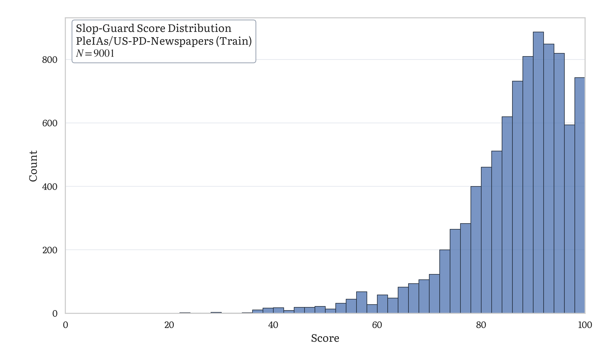
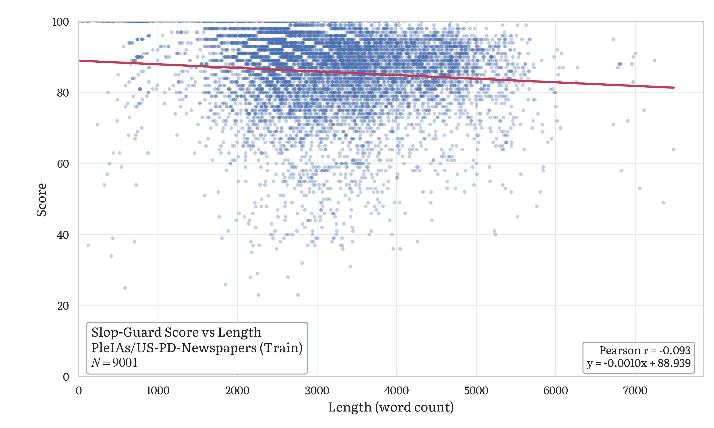
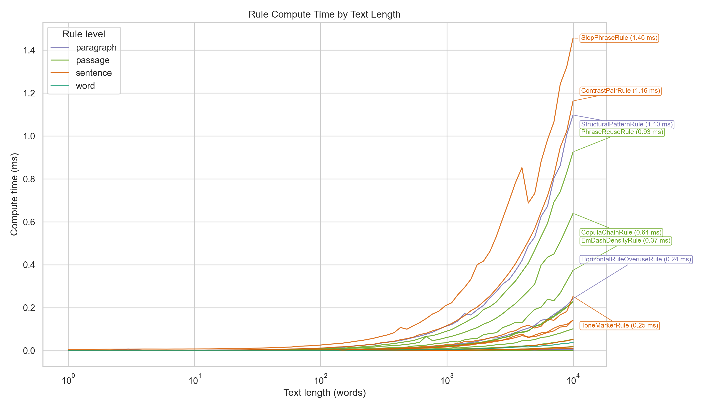

# slop-guard

[](https://eric-tramel.github.io/slop-guard/docs/)

A rule-based prose linter that scores text 0--100 for formulaic AI writing patterns. No LLM judge, no API calls. Purely programmatic.

slop-guard ships two rule presets:

- **`ai_slop`** (the default) — 24 rules targeting model-generated tells: stock hype words, boilerplate phrases, assistant tone markers, structural patterns, and rhythm tics.
- **`writing_quality`** — 14 opinionated style rules: qualifier words, verbose phrases, pretentious vocabulary with replacements, redundant pairs, clichés, foreign/Latin phrases, ecstatic adjectives, throat-clearing, over-explanation, two-tier passive voice, long sentences, exclamation density, emoji in prose, and narrative-poetic Markdown headings.

Default-only output is unchanged from earlier releases. When the writing-quality preset is loaded (alone or alongside the default), each violation gains a `category` field and the result gains a `category_counts` aggregation. See [Rule presets](#rule-presets) for how to choose between them.

## Add to Your Agent

Both clients use the same MCP command: `uvx slop-guard`.
If you want a custom rule JSONL, append `-c /path/to/config.jsonl`.
The default rule set is the `ai_slop` preset; pass `-c` with the writing-quality JSONL to opt into those checks. See [Rule presets](#rule-presets) for the bundled paths.

### Claude Code

Add from the command line:

```bash
claude mcp add slop-guard -- uvx slop-guard
```

Add to your `.mcp.json`:

```json
{
  "mcpServers": {
    "slop-guard": {
      "command": "uvx",
      "args": ["slop-guard"]
    }
  }
}
```

### Codex

Add from the command line:

```bash
codex mcp add slop-guard -- uvx slop-guard
```

Add to your `~/.codex/config.toml`:

```toml
[mcp_servers.slop-guard]
command = "uvx"
args = ["slop-guard"]
```

If you want a fixed release, pin it in `args`, for example: `["slop-guard==0.4.1"]`.

## Rule presets

slop-guard ships two packaged JSONL rule files. Pick one with the `-c` flag (CLI) or the `args` array (MCP).

| Preset | Bundled path | What it catches |
|--------|--------------|-----------------|
| `ai_slop` (default) | `slop_guard/rules/assets/default.jsonl` | Model-generated tells, structural patterns, rhythm tics |
| `writing_quality` | `slop_guard/rules/assets/writing_quality.jsonl` | Style problems: clichés, redundancy, passive voice, verbose phrasing |

The bundled paths sit inside the installed package. To resolve the absolute path on your system, use `importlib.resources`:

```bash
WQ_PATH=$(python -c 'from importlib.resources import files; print(files("slop_guard.rules").joinpath("assets/writing_quality.jsonl"))')
```

### CLI examples

Run the default `ai_slop` rules:

```bash
sg draft.md
# => draft.md: 72/100 [light] (1843 words) *
```

Run the `writing_quality` rules instead:

```bash
sg -c "$WQ_PATH" draft.md
# => draft.md: 65/100 [light] (1843 words) *
```

Run both presets together by concatenating the JSONL files into one config:

```bash
DEFAULT_PATH=$(python -c 'from importlib.resources import files; print(files("slop_guard.rules").joinpath("assets/default.jsonl"))')
cat "$DEFAULT_PATH" "$WQ_PATH" > all_rules.jsonl
sg -c all_rules.jsonl draft.md
```

### MCP examples

The MCP server reads the same `-c` flag from its launch arguments. Configure two server entries when you want both presets available to an agent — one with the default rules and one with the writing-quality rules.

For Claude Code in `.mcp.json`:

```json
{
  "mcpServers": {
    "slop-guard": {
      "command": "uvx",
      "args": ["slop-guard"]
    },
    "slop-guard-writing-quality": {
      "command": "uvx",
      "args": [
        "--with",
        "slop-guard",
        "sh",
        "-c",
        "uvx slop-guard -c $(python -c 'from importlib.resources import files; print(files(\"slop_guard.rules\").joinpath(\"assets/writing_quality.jsonl\"))')"
      ]
    }
  }
}
```

A simpler approach is to copy the writing-quality JSONL out of the package once and reference it by path:

```bash
python -c 'from importlib.resources import files; print(files("slop_guard.rules").joinpath("assets/writing_quality.jsonl").read_text())' > ~/.config/slop-guard/writing_quality.jsonl
```

Then point your MCP entry at that file:

```json
{
  "mcpServers": {
    "slop-guard-writing-quality": {
      "command": "uvx",
      "args": ["slop-guard", "-c", "~/.config/slop-guard/writing_quality.jsonl"]
    }
  }
}
```

Codex uses the same pattern in `~/.codex/config.toml`:

```toml
[mcp_servers.slop-guard]
command = "uvx"
args = ["slop-guard"]

[mcp_servers.slop-guard-writing-quality]
command = "uvx"
args = ["slop-guard", "-c", "/Users/you/.config/slop-guard/writing_quality.jsonl"]
```

## CLI

The `sg` command lints prose from the terminal. No API keys, no network calls.

### Quick start

```bash
# Run without installing
uvx --from slop-guard sg README.md

# Or install it
uv tool install slop-guard
sg README.md
```

### Usage

```
sg [OPTIONS] INPUT [INPUT ...]
```

`sg` requires at least one input. Each input can be a file path, `-` for stdin, or quoted inline prose text:

```bash
sg "This is some test text"
echo "Latency dropped from 180 ms to 95 ms." | sg -
```

Lint multiple files at once (shell-level glob expansion):

```bash
sg docs/*.md README.md
sg path/**/*.md
```

### Options

| Flag | Description |
|------|-------------|
| `-j`, `--json` | Output results as JSON, including `source` as the raw inline/stdin text or full file path |
| `-v`, `--verbose` | Show individual violations and advice |
| `-q`, `--quiet` | Only print sources that fail the threshold |
| `-t SCORE`, `--threshold SCORE` | Minimum passing score (0-100). Exit 1 if any input scores below this |
| `-c JSONL`, `--config JSONL` | Path to JSONL rule configuration. Defaults to packaged settings |
| `-s`, `--score-only` | Print only numeric score output |
| `--counts` | Show per-rule hit counts in the summary line |

### Examples

```bash
# One-line summary per file
sg draft.md
# => draft.md: 72/100 [light] (1843 words) *

# Score-only output
sg -s draft.md

# Use a custom rule config
sg -c /path/to/config.jsonl draft.md

# Verbose output with violations and advice
sg -v draft.md

# JSON for scripting
sg -j report.md | jq '.score'

# JSON preserves the true CLI input identity
sg -j "The migration finished in 12 seconds." | jq '.source'
# => "The migration finished in 12 seconds."

# CI gate: fail if any file scores below 60
sg -t 60 docs/*.md

# Quiet mode: only show failures
sg -q -t 60 **/*.md
```

### Exit codes

| Code | Meaning |
|------|---------|
| 0 | Success (all files pass threshold, or no threshold set) |
| 1 | One or more files scored below the threshold |
| 2 | Error (bad file path, read failure, etc.) |

## Fit Rule Configs (`sg-fit`)

Use `sg-fit` to fit a rule JSONL config from corpus data:

```bash
# Legacy shorthand
sg-fit TARGET_CORPUS OUTPUT

# Multi-input mode (for shell-expanded globs or many files)
sg-fit --output OUTPUT TRAIN_INPUT [TRAIN_INPUT ...]
```

Example:

```bash
sg-fit data.jsonl rules.fitted.jsonl
sg-fit --output rules.fitted.jsonl **/*.txt **/*.md
```

Optional arguments:

- `--init JSONL`: Start from a specific rule config JSONL instead of packaged defaults.
- `--negative-dataset INPUT [INPUT ...]`: Add negative dataset inputs. This flag can be repeated; all negative rows are normalized to label `0`.
- `--no-calibration`: Skip post-fit contrastive penalty calibration for faster fitting on large corpora.
- `--output JSONL`: Required when you pass more than one training input.

Target corpus rows can be either:

```json
{"text": "body of text", "label": 1}
```

or:

```json
{"text": "body of text"}
```

If `label` is omitted in the target corpus, `sg-fit` treats it as `1` (positive/target style).

`sg-fit` also accepts `.txt` and `.md` files. Each file is normalized into a single training sample.

## Installation

Requires [uv](https://docs.astral.sh/uv/).

Run without installing (recommended for MCP setups):

```bash
uvx slop-guard
# MCP server with custom rule config
uvx slop-guard -c /path/to/config.jsonl
```

Install persistently (gives you `slop-guard`, `sg`, and `sg-fit`):

```bash
uv tool install slop-guard
```

Pin versions for reproducibility:

```bash
uvx slop-guard==0.4.1
```

Upgrade an installed tool:

```bash
uv tool upgrade slop-guard
```

### From source

From a local checkout:

```bash
uv run slop-guard               # MCP server
uv run slop-guard -c config.jsonl
uv run sg            # CLI linter
uv run sg-fit data.jsonl rules.fitted.jsonl
```

Core development workflows are also exposed through `make`:

```bash
make sync
make check
make fix
make build
make verify-wheel
```

## MCP Tools

`check_slop(text)`: Analyze a string. Returns JSON diagnostics only; it does not repeat the input text.

`check_slop_file(file_path)`: Read a file from disk and analyze it. Same output, without repeating the file path in the payload.

## What it catches

The default `ai_slop` preset covers stock hype words and boilerplate phrases, assistant tone markers, unattributed weasel phrasing, AI self-disclosure, placeholder text, bullet/blockquote/horizontal-rule-heavy Markdown structures, sentence and paragraph rhythm, and em dash or colon overuse.

It also flags contrast/setup-resolution tells, pithy fragments, repeated 4-8 word phrases, copula chains, extreme long sentences, aphoristic closers, and uneven paragraph cadence.

The `writing_quality` preset (opt-in via `-c`) targets style instead of AI fingerprints. At the word level it flags weakening qualifiers, pretentious vocabulary, and ecstatic adjectives. At the phrase and sentence level it covers verbose phrasing, redundant pairs, clichés, foreign and Latin phrases, throat-clearing, over-explanation, and two-tier passive voice. At the passage level it adds long sentences, exclamation density, emoji in prose, and `narrative-poetic` Markdown headings.

Several rules ship explicit replacements so the advice names the substitution. The advice for the wordy phrase you would replace with `to` is `Replace 'in order to' with 'to'.`, and the same shape applies to `utilize` → `use`, `methodology` → `method`, and `per se` → `by itself`. See [Rule presets](#rule-presets) for how to enable the preset.

Texts under 10 words are skipped and return a clean `100`.

Otherwise scoring uses exponential decay: `score = 100 * exp(-lambda * density)`, where density is the weighted penalty sum normalized per 1000 words. Claude-specific categories (contrast pairs, setup-resolution, pithy fragments) get a concentration multiplier. Repeated use of the same tic costs more than diverse violations.

## Scoring bands

| Score | Band |
|-------|------|
| 80-100 | Clean |
| 60-79 | Light |
| 40-59 | Moderate |
| 20-39 | Heavy |
| 0-19 | Saturated |

## Output

CLI `--json` output and MCP tool responses share this structure:

```
source           CLI JSON only; raw inline/stdin text or full file path
score            0-100 integer
band             "clean" / "light" / "moderate" / "heavy" / "saturated"
word_count       integer
violations       array of {type, rule, match, context, penalty, start, end}
counts           per-rule violation counts (keyed by rule count_key)
total_penalty    sum of all penalty values
weighted_sum     after concentration multiplier
density          weighted_sum per 1000 words
advice           array of advice strings, one per distinct issue
```

When the active pipeline includes any non-default category — typically when you load `writing_quality.jsonl` via `-c` — two extra fields appear:

```
violations[].category  "ai_slop" or "writing_quality"
category_counts        per-category violation counts (e.g. {"writing_quality": 3})
```

The default `ai_slop`-only pipeline produces the original schema with neither field, so existing consumers are unaffected.

MCP tool responses omit `source`, because the tool transport already carries the
input parameter.

`violations[].type` is always `"Violation"` for typed records.

## Benchmark snapshot

Example score distribution from `benchmark/us_pd_newspapers_histogram.py` on
`PleIAs/US-PD-Newspapers` (first 9,001 rows of one local shard):



Example score-vs-length scatter plot from
`benchmark/us_pd_newspapers_scatter.py` on the same shard:



Example per-rule compute-time curves from `benchmark/compute-time.py` +
`benchmark/chart.py` (annotated with the slowest rules at max length):



## License

MIT

## Acknowledgements

- [@secemp9](https://x.com/secemp9) for his original [anti-slop rubric](https://github.com/secemp9/rubrics/blob/main/special_ones/anti_slop_rubric.xml) and inspiration.
- [@myainotez](https://x.com/myainotez) for their contributions and many helpful conversations about the project.
